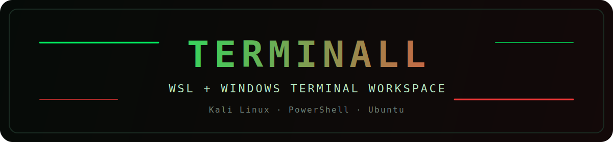
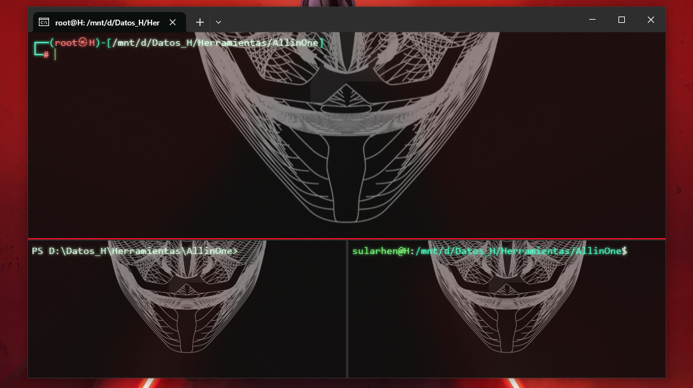

# TerminALL

Windows setup project for a structured triple-pane Windows Terminal workspace with:

- `Kali Linux` on top
- `Windows PowerShell` bottom-left
- `Ubuntu` bottom-right
- hotkey `Ctrl+Alt+T`
- bundled shortcut icon
- user-provided terminal background
- compact tool inventories for Kali and Ubuntu

---

## English

### Overview

`TerminALL` automates the setup of a multi-pane Windows Terminal workspace on Windows using `WSL`, `Ubuntu`, and `Kali Linux`.

It is intended for personal labs, reproducible workstation setup, onboarding, and lightweight pentesting/dev environments.

### Features

- Installs or updates `WSL`
- Installs `Ubuntu` and `kali-linux`
- Installs `kali-linux-large` inside Kali
- Installs `Windows Terminal` if it is missing
- Applies a triple-pane terminal layout
- Adds pane navigation with `Ctrl + Arrow Keys`
- Creates a desktop shortcut with `Ctrl+Alt+T`
- Uses a bundled shortcut icon
- Refreshes the terminal background automatically from `terminal-background`
- Exports a compact inventory of top Kali pentesting tools and Ubuntu core tools

### Storage requirements

Recommended free disk space before installation:

- Minimum usable: `25 GB`
- Recommended: `35 GB` or more

Typical space drivers:

- `kali-linux-large`: roughly `18-22 GB`
- `Ubuntu` base environment: roughly `2-4 GB`
- `Windows Terminal`, WSL metadata, logs, caches, and future package growth: additional headroom recommended

### Download

#### Option 1 - Git

```powershell
git clone <YOUR_GITHUB_REPO_URL>
cd TerminALL
```

#### Option 2 - ZIP

1. Download the repository as a ZIP archive from GitHub.
2. Extract it on a Windows machine.
3. Open the extracted folder.

### Execution

1. Place one image in `terminal-background/`.
2. Right-click `setup-terminal.cmd`.
3. Run it as administrator.
4. Follow the bilingual prompts.
5. Open the final layout with `Ctrl+Alt+T` or the desktop shortcut.

### Reference view



The project is designed around a centered triple-pane layout with:

- `Kali Linux` in the top pane
- `Windows PowerShell` in the lower-left pane
- `Ubuntu` in the lower-right pane
- hacker-style theme
- transparent background image

### Repository layout

- `setup-terminal.cmd` - primary entry point
- `setup-terminal.ps1` - main installer
- `launch-terminal-layout.cmd` - opens the terminal layout
- `launch-wsl-profile.ps1` - validates WSL before opening each distro pane
- `position-terminal-window.ps1` - repositions the window after launch
- `sync-terminal-background.ps1` - updates the background image before launch
- `export-wsl-inventory.ps1` - exports compact tool inventories
- `inventories/kali-top-tools.md` - compact Kali pentesting inventory
- `inventories/ubuntu-core-tools.md` - compact Ubuntu core tools inventory
- `terminal-shortcut.ico` - desktop shortcut icon
- `terminal-background/` - folder for user-provided images

### Current compact inventories

#### Kali

The current Kali inventory detects these top pentesting tools:

- Recon / discovery: `nmap`, `tcpdump`, `wireshark`
- Web pentesting: `sqlmap`, `nikto`, `gobuster`, `ffuf`, `dirb`, `wpscan`, `burpsuite`
- Passwords / cracking: `hydra`, `john`, `hashcat`
- Exploitation / post: `msfconsole`, `responder`, `netexec`
- Wireless: `aircrack-ng`

Reference file:

- `inventories/kali-top-tools.md`

#### Ubuntu

The current Ubuntu inventory detects these core tools:

- Shell / navigation: `bash`, `tmux`, `vim`, `nano`
- Network / remote: `ssh`, `curl`, `wget`
- Development: `git`, `python3`, `pip3`, `gcc`, `make`
- Data / JSON: `jq`

Reference file:

- `inventories/ubuntu-core-tools.md`

### Refreshing inventories

Run:

`powershell.exe -ExecutionPolicy Bypass -File .\export-wsl-inventory.ps1`

This regenerates:

- `inventories/kali-top-tools.md`
- `inventories/ubuntu-core-tools.md`

### Operational notes

- The desktop hotkey works after Windows sign-in while `Explorer` is running.
- The project does not auto-launch Terminal at every Windows sign-in.
- `windows-terminal-portable/`, logs, temporary scripts, and personal background images are ignored by Git.
- If the packaged Microsoft Store version of Windows Terminal is broken on a local machine, the portable runtime can still be used locally, but it is not intended to be committed.

### Version control notes

Recommended repository contents:

- all `.ps1`, `.cmd`, `.md`, `.ico`, `.gitignore`
- `inventories/`
- `terminal-background/PUT_IMAGE_HERE.txt`
- `terminal-background/.gitkeep`

Keep local logs and personal background images out of version control unless they are intentionally part of the project.

---

## Español

### Descripcion general

`TerminALL` automatiza la configuracion de un entorno de trabajo en Windows Terminal con layout triple usando `WSL`, `Ubuntu` y `Kali Linux`.

Esta pensado para laboratorios personales, configuraciones repetibles de estaciones de trabajo, onboarding y entornos livianos de pentesting/desarrollo.

### Caracteristicas

- Instala o actualiza `WSL`
- Instala `Ubuntu` y `kali-linux`
- Instala `kali-linux-large` dentro de Kali
- Instala `Windows Terminal` si falta
- Aplica un layout triple de terminal
- Agrega navegacion entre paneles con `Ctrl + Flechas`
- Crea un acceso directo de escritorio con `Ctrl+Alt+T`
- Usa un icono incluido para el acceso directo
- Actualiza automaticamente el fondo desde `terminal-background`
- Exporta un inventario compacto de herramientas top de Kali y herramientas base de Ubuntu

### Espacio requerido

Espacio libre recomendado antes de instalar:

- Minimo util: `25 GB`
- Recomendado: `35 GB` o mas

Consumo tipico de espacio:

- `kali-linux-large`: aproximadamente `18-22 GB`
- entorno base de `Ubuntu`: aproximadamente `2-4 GB`
- `Windows Terminal`, metadatos de WSL, logs, caches y crecimiento futuro: se recomienda dejar margen adicional

### Descarga

#### Opcion 1 - Git

```powershell
git clone <TU_URL_DE_GITHUB>
cd TerminALL
```

#### Opcion 2 - ZIP

1. Descarga el repositorio como archivo ZIP desde GitHub.
2. Extraelo en una maquina Windows.
3. Abre la carpeta extraida.

### Ejecucion

1. Coloca una imagen en `terminal-background/`.
2. Haz clic derecho en `setup-terminal.cmd`.
3. Ejecutalo como administrador.
4. Sigue los prompts bilingues.
5. Abre el layout final con `Ctrl+Alt+T` o el acceso directo del escritorio.

### Vista de referencia


El proyecto esta pensado alrededor de un layout triple centrado con:

- `Kali Linux` en el panel superior
- `Windows PowerShell` en el panel inferior izquierdo
- `Ubuntu` en el panel inferior derecho
- tema estilo hacker
- imagen de fondo con transparencia

### Estructura del repositorio

- `setup-terminal.cmd` - punto de entrada principal
- `setup-terminal.ps1` - instalador principal
- `launch-terminal-layout.cmd` - abre el layout de la terminal
- `launch-wsl-profile.ps1` - valida WSL antes de abrir cada panel
- `position-terminal-window.ps1` - recoloca la ventana despues de abrir
- `sync-terminal-background.ps1` - actualiza la imagen de fondo antes de abrir
- `export-wsl-inventory.ps1` - exporta inventarios compactos
- `inventories/kali-top-tools.md` - inventario compacto de pentesting en Kali
- `inventories/ubuntu-core-tools.md` - inventario compacto de herramientas base en Ubuntu
- `terminal-shortcut.ico` - icono del acceso directo
- `terminal-background/` - carpeta para imagenes del usuario

### Inventarios compactos actuales

#### Kali

El inventario actual de Kali detecta estas herramientas top de pentesting:

- Reconocimiento / descubrimiento: `nmap`, `tcpdump`, `wireshark`
- Pentesting web: `sqlmap`, `nikto`, `gobuster`, `ffuf`, `dirb`, `wpscan`, `burpsuite`
- Passwords / cracking: `hydra`, `john`, `hashcat`
- Explotacion / post: `msfconsole`, `responder`, `netexec`
- Wireless: `aircrack-ng`

Archivo de referencia:

- `inventories/kali-top-tools.md`

#### Ubuntu

El inventario actual de Ubuntu detecta estas herramientas base:

- Shell / navegacion: `bash`, `tmux`, `vim`, `nano`
- Red / acceso remoto: `ssh`, `curl`, `wget`
- Desarrollo: `git`, `python3`, `pip3`, `gcc`, `make`
- Datos / JSON: `jq`

Archivo de referencia:

- `inventories/ubuntu-core-tools.md`

### Como refrescar los inventarios

Ejecuta:

`powershell.exe -ExecutionPolicy Bypass -File .\export-wsl-inventory.ps1`

Esto regenera:

- `inventories/kali-top-tools.md`
- `inventories/ubuntu-core-tools.md`

### Notas operativas

- El hotkey del escritorio funciona despues de iniciar sesion en Windows, mientras `Explorer` este activo.
- El proyecto ya no abre Terminal automaticamente en cada inicio de sesion.
- `windows-terminal-portable/`, logs, scripts temporales e imagenes personales quedan ignorados por Git.
- Si la version empaquetada de Windows Terminal falla en una maquina local, el runtime portable puede usarse localmente, pero no esta pensado para ser versionado.

### Notas de control de versiones

Contenido recomendado del repositorio:

- todos los `.ps1`, `.cmd`, `.md`, `.ico`, `.gitignore`
- `inventories/`
- `terminal-background/PUT_IMAGE_HERE.txt`
- `terminal-background/.gitkeep`

Mantiene fuera del control de versiones los logs locales y las imagenes personales de fondo, salvo que formen parte intencional del proyecto.
