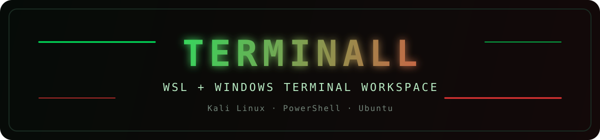

# TerminALL

Public Windows Terminal workspace for Kali Linux, Windows PowerShell, and Ubuntu.

TerminALL opens a deterministic three-pane layout:

- Kali Linux on top (kept on WSL 2)
- Windows PowerShell at lower left
- Ubuntu at lower right (its installed WSL version is left unchanged)

This public edition deliberately contains no AI client, endpoint, network address, credential, user profile, or machine-specific configuration.

## Features

- Windows 10 and Windows 11 support
- WSL and distribution setup when required
- Bounded WSL diagnostics with bilingual guidance
- Configurable portable Windows Terminal selection
- No global `startupActions`; unrelated Terminal windows retain their own layout
- Desktop hotkey: `Ctrl+Alt+T`
- Pane focus: `Ctrl+Arrow Keys`
- Maximize/restore active pane: `Alt+Shift+Enter`
- Opaque, high-contrast scheme for readable Linux `ls` output

## Install

Run PowerShell as administrator for a full WSL installation:

```powershell
.\setup-terminal.cmd
```

To update only Terminal profiles and the desktop shortcut:

```powershell
.\setup-terminal.cmd -English -ConfigureOnly -SkipBackground
```

If the Store build is unavailable, use a portable executable. Its selection is saved outside the repository at `%LOCALAPPDATA%\TerminALL\terminal-config.json`:

```powershell
.\setup-terminal.cmd -English -ConfigureOnly -SkipBackground -TerminalExecutable "C:\path\to\WindowsTerminal.exe"
```

Open the layout with `Ctrl+Alt+T` or the `TerminALL Terminal.lnk` shortcut on the desktop.

## Controls

- `Ctrl+Left`, `Ctrl+Right`, `Ctrl+Up`, `Ctrl+Down`: move pane focus.
- `Alt+Shift+Enter`: maximize or restore the focused pane.
- `Ctrl+Alt+T`: open a fresh three-pane layout.

## Privacy and local files

Do not commit user backgrounds, portable Terminal files, logs, backups, private instructions, credentials, network addresses, or machine-specific settings. The supplied `.gitignore` excludes common local artifacts.

## Tests

```powershell
.\tests\run-tests.ps1
```

The test suite parses PowerShell sources and verifies layout generation, portable resolution, safe configuration-only mode, hotkeys, WSL diagnostics, and the public no-AI boundary.

## Troubleshooting

- If WSL is temporarily unavailable, run `wsl --shutdown`, then inspect `wsl --status` and `wsl --list --verbose`.
- Kali must remain WSL 2; TerminALL never converts Ubuntu automatically.
- If a portable executable was moved, rerun setup with `-TerminalExecutable`.
- Restart Windows only after the fast diagnostics fail.

---

## Espanol

Espacio de trabajo publico para Windows Terminal con Kali Linux, Windows PowerShell y Ubuntu.

TerminALL abre un layout determinista de tres paneles:

- Kali Linux arriba (se mantiene en WSL 2)
- Windows PowerShell abajo a la izquierda
- Ubuntu abajo a la derecha (no cambia su version WSL instalada)

Esta edicion publica no incluye cliente de IA, endpoint, direccion de red, credencial, perfil de usuario ni configuracion especifica de una maquina.

### Funciones

- Soporte para Windows 10 y Windows 11
- Instalacion de WSL y distribuciones cuando hace falta
- Diagnostico WSL acotado con guia bilingue
- Seleccion configurable de Windows Terminal portable
- Sin `startupActions` globales; otras ventanas de Terminal conservan su layout
- Atajo de escritorio: `Ctrl+Alt+T`
- Foco entre paneles: `Ctrl+Flechas`
- Maximizar/restaurar panel activo: `Alt+Shift+Enter`
- Esquema opaco de alto contraste para que `ls` sea legible

### Instalacion

Ejecuta PowerShell como administrador para una instalacion completa de WSL:

```powershell
.\setup-terminal.cmd
```

Para actualizar solo perfiles y acceso directo:

```powershell
.\setup-terminal.cmd -Spanish -ConfigureOnly -SkipBackground
```

Si la version Store no esta disponible, usa un ejecutable portable. La seleccion queda fuera del repositorio en `%LOCALAPPDATA%\TerminALL\terminal-config.json`:

```powershell
.\setup-terminal.cmd -Spanish -ConfigureOnly -SkipBackground -TerminalExecutable "C:\ruta\a\WindowsTerminal.exe"
```

Abre el layout con `Ctrl+Alt+T` o con `TerminALL Terminal.lnk` del escritorio.

### Controles

- `Ctrl+Izquierda`, `Ctrl+Derecha`, `Ctrl+Arriba`, `Ctrl+Abajo`: mueve el foco.
- `Alt+Shift+Enter`: maximiza o restaura el panel activo.
- `Ctrl+Alt+T`: abre un layout nuevo de tres paneles.

### Privacidad y archivos locales

No subas fondos del usuario, archivos del Terminal portable, logs, respaldos, instrucciones privadas, credenciales, direcciones de red ni configuraciones especificas de una maquina. El `.gitignore` incluido excluye artefactos locales comunes.

### Pruebas

```powershell
.\tests\run-tests.ps1
```

### Resolucion de problemas

- Si WSL no responde temporalmente, ejecuta `wsl --shutdown` y revisa `wsl --status` y `wsl --list --verbose`.
- Kali debe mantenerse en WSL 2; TerminALL nunca convierte Ubuntu automaticamente.
- Si moviste el portable, vuelve a ejecutar setup con `-TerminalExecutable`.
- Reinicia Windows solo despues de que fallen los diagnosticos rapidos.
